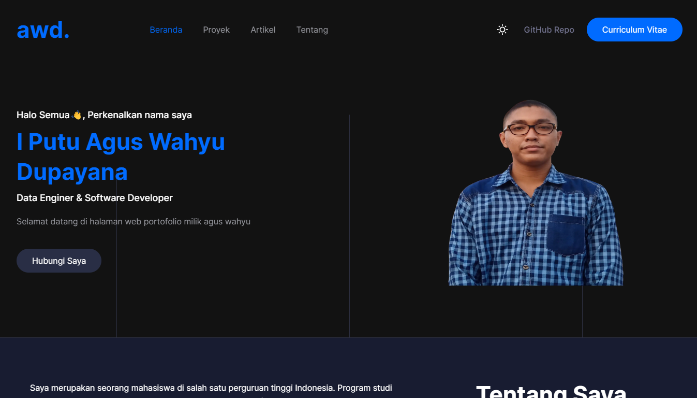
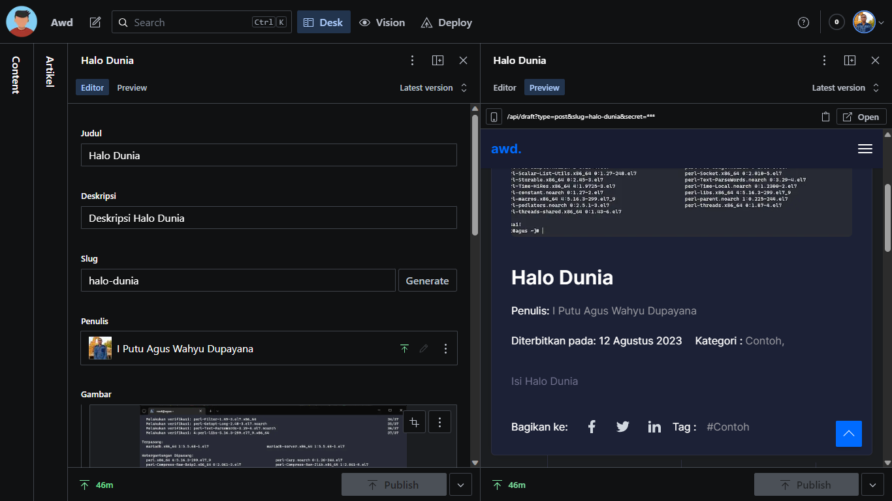

# Awd Portofolio Next Sanity

## More Documentatian : [Awd Docs][docs-homepage]

This starter is a statically generated personal website that uses [Next.js][nextjs] for the frontend and [Sanity][sanity-homepage] to handle its content.
It comes with a native Sanity Studio that offers features like real-time collaboration, instant side-by-side content previews, and intuitive editing.

The Studio connects to Sanity Content Lake, which gives you hosted content APIs with a flexible query language, on-demand image transformations, powerful patching, and more.
You can use this starter to kick-start a personal website or learn these technologies.

[][vercel-deploy]

## Features

- A performant, static personal website with editable projects
- A native and customizable authoring environment, accessible on `yourpersonalwebsite.com/studio`
- Real-time and collaborative content editing with fine-grained revision history
- Side-by-side instant content preview that works across your whole site
- Support for block content and the most advanced custom fields capability in the industry
- Webhook-triggered Incremental Static Revalidation; no need to wait for a rebuild to publish new content
- Free Sanity project with unlimited admin users, free content updates, and pay-as-you-go for API overages
- A project with starter-friendly and not too heavy-handed TypeScript and Tailwind.css

## Table of Contents

- [Awd Portofolio Next Sanity](#awd-portofolio-next-sanity)
  - [More Documentatian : Awd Docs](#more-documentatian--awd-docs)
  - [Features](#features)
  - [Table of Contents](#table-of-contents)
  - [Project Overview](#project-overview)
    - [Important files and folders](#important-files-and-folders)
  - [Configuration](#configuration)
    - [Step 1. Set up the environment](#step-1-set-up-the-environment)
    - [Step 2. Set up the project locally](#step-2-set-up-the-project-locally)
    - [Step 3. Run Next.js locally in development mode](#step-3-run-nextjs-locally-in-development-mode)
    - [Step 4. Deploy to production](#step-4-deploy-to-production)

## Project Overview

| [Personal Website](https://awd.my.id/) | [Studio](https://awd.my.id/studio) |
| -------------------------------------- | ---------------------------------- |
|  |   |

### Important files and folders

| File(s)                                        | Description                                             |
| ---------------------------------------------- | ------------------------------------------------------- |
| `sanity.config.ts`                             | Config file for Sanity Studio                           |
| `sanity.cli.ts`                                | Config file for Sanity CLI                              |
| `/src/app/(admin)studio/[[...index]]/page.tsx` | Where Sanity Studio is mounted                          |
| `/src/app/(user)studio`                        | Home Page Site                                          |
| `/src/app/api/draft.ts`                        | Serverless route for triggering Draft mode              |
| `/schemas`                                     | Where Sanity Studio gets its content types from         |
| `/plugins`                                     | Where the advanced Sanity Studio customization is setup |
| `/lib/client.ts`,`/lib/image.ts`               | Configuration for the Sanity Content Lake client        |

## Configuration

### Step 1. Set up the environment

Use the Deploy Button below. It will let you deploy the starter using [Vercel](https://vercel.com?utm_source=github&utm_medium=readme&utm_campaign=next-sanity-example) as well as connect it to your Sanity Content Lake using [the Sanity Vercel Integration][integration].

[][vercel-deploy]

### Step 2. Set up the project locally

[Clone the repository](https://docs.github.com/en/repositories/creating-and-managing-repositories/cloning-a-repository) that was created for you on your GitHub account. Once cloned, run the following command from the project's root directory:

```bash
npx vercel link
```

Download the environment variables needed to connect Next.js and the Studio to your Sanity project:

```bash
npx vercel env pull
```

### Step 3. Run Next.js locally in development mode

```bash
npm install && npm run dev
```

When you run this development server, the changes you make in your frontend and studio configuration will be applied live using hot reloading.

Your personal website should be up and running on [http://localhost:3000][localhost-3000]! You can create and edit content on [http://localhost:3000/studio][localhost-3000-studio].

### Step 4. Deploy to production

To deploy your changes to production you use `git`:

```bash
git add .
git commit
git push
```

Alternatively, you can deploy without a `git` hosting provider using the Vercel CLI:

```bash
npx vercel --prod
```

[docs-homepage]: htttps://docs.awd.my.id/next-sanity
[vercel-deploy]: https://vercel.com/new/clone?repository-url=https%3A%2F%2Fgithub.com%2Fputuwahyu29%2Fawd-portofolio-next-sanity&project-name=https%3A%2F%2Fgithub.com%2Fputuwahyu29%2Fawd-portofolio-next-sanity&repository-name=https%3A%2F%2Fgithub.com%2Fputuwahyu29%2Fawd-portofolio-next-sanity&demo-title=Awd+Portofolio+Next+Sanity&demo-description=Portfolio&demo-url=https%3A%2F%2Fawd-portofolio.awd.my.id&demo-image=https%3A%2F%2Fcdn.sanity.io%2Fimages%2F81pocpw8%2Fproduction%2F07a7a03a6ccd03b765b2769acb038f31bcbbab1c-1347x768.png&integration-ids=oac_hb2LITYajhRQ0i4QznmKH7gx&external-id=%3Btemplate%3Dawd-portofolio-next-sanity
[integration]: https://www.sanity.io/docs/vercel-integration?utm_source=github.com&utm_medium=referral&utm_campaign=nextjs-v3vercelstarter
[`.env.local.example`]: .env.local.example
[nextjs]: https://github.com/vercel/next.js
[sanity-create]: https://www.sanity.io/get-started/create-project?utm_source=github.com&utm_medium=referral&utm_campaign=nextjs-v3vercelstarter
[sanity-deployment]: https://www.sanity.io/docs/deployment?utm_source=github.com&utm_medium=referral&utm_campaign=nextjs-v3vercelstarter
[sanity-homepage]: https://www.sanity.io?utm_source=github.com&utm_medium=referral&utm_campaign=nextjs-v3vercelstarter
[sanity-community]: https://slack.sanity.io/
[sanity-schema-types]: https://www.sanity.io/docs/schema-types?utm_source=github.com&utm_medium=referral&utm_campaign=nextjs-v3vercelstarter
[sanity-github]: https://github.com/sanity-io/sanity/discussions
[sanity-groq]: https://www.sanity.io/docs/groq?utm_source=github.com&utm_medium=referral&utm_campaign=nextjs-v3vercelstarter
[sanity-content-modelling]: https://www.sanity.io/docs/content-modelling?utm_source=github.com&utm_medium=referral&utm_campaign=nextjs-v3vercelstarter
[sanity-webhooks]: https://www.sanity.io/docs/webhooks?utm_source=github.com&utm_medium=referral&utm_campaign=nextjs-v3vercelstarter
[localhost-3000]: http://localhost:3000
[localhost-3000-studio]: http://localhost:3000/studio
[vercel]: https://vercel.com
[vercel-github]: https://github.com/vercel/next.js/discussions
[app-dir]: https://beta.nextjs.org/docs/routing/fundamentals#the-app-directory
